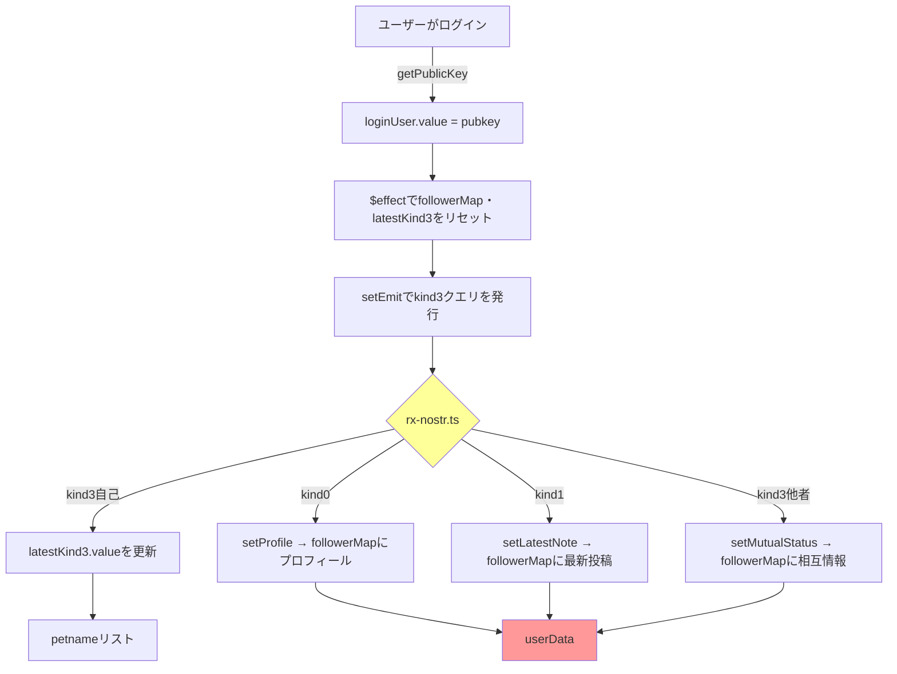

# NFO2 現状整理レポート

## 1. プロジェクト概要

**Nostr Follow Organizer 2 (NFO2)** — Svelte 5 ベースの Nostr フォローリスト整理ツール

- **フレームワーク**: Svelte 5 + SvelteKit + TypeScript
- **スタイリング**: Tailwind CSS v4
- **テスト**: Vitest
- **Nostr通信**: rx-nostr v3
- **ログイン**: @konemono/nostr-login (NIP-07 / NIP-46 / NIP-49 対応)
- **パッケージ構成**: npm Workspaces（`packages/vitest-nostr` をローカルパッケージとして使用）

---

## 2. 現在のディレクトリ構造（主要ファイル）

```
NFO2/
├── src/
│   ├── routes/
│   │   ├── +layout.svelte      # レイアウト（ログイン・ダークモード・rx-nostr初期化）
│   │   ├── +page.svelte        # 空（まだ実装なし）
│   │   └── layout.css          # グローバルスタイル
│   └── lib/
│       ├── store/
│       │   └── followStore.svelte.ts  # ⚠️ 全ステート集中地（後述）
│       ├── nostr/
│       │   └── rx-nostr.ts     # rx-nostrのセットアップ・クエリ発行
│       ├── types/
│       │   ├── followerMap.ts  # FollowerMap, UserData, MutualStatus
│       │   ├── profile.ts      # Profile, SortOrder
│       │   └── index.ts
│       ├── utils/
│       │   ├── utils.ts        # getProfile(), getFollowList()
│       │   ├── sortFollowers.ts# sortFollowers()
│       │   └── regex.ts
│       └── __tests__/          # テストファイル
├── packages/vitest-nostr/      # ローカルテスト用Nostrモックパッケージ
├── 仕様書.md
└── material-theme/             # Tailwind materialテーマ
```

---

## 3. 現在のステート管理構造（⚠️ 問題点）

### 3.1 followStore.svelte.ts での一元管理

```typescript
// followStore.svelte.ts
export const loginUser: { value: string } = $state({ value: "" });
export const followerMap: { value: FollowerMap } = $state({ value: {} });
export const latestKind3: { value: Nostr.Event | null } = $state({ value: null });
```

**UserData の構造:**
```typescript
interface UserData {
  npub: string;
  relayUrl?: string;
  petname?: string;          // ← kind3の4要素目から取得
  profile?: Profile;
  mutualStatus: MutualStatus; // "mutual" | "notMutual" | "unknown"
  latestNote?: Nostr.Event;   // kind1
}
```

**問題点:**
1. すべてのユーザーデータが `followerMap` という1つの `Record<string, UserData>` に突っ込まれている
2. `followerMap` は `$state` で一元管理 → 変更時に全体が再レンダリングされる可能性がある
3. 更新系関数（`setPetname`, `setProfile`, `setLatestNote`等）がストア内に散在
4. kind0(kind1, kind3, kind100)のデータがすべて同じ UserData 型に混在している

---

## 4. データフロー（現在のアーキテクチャ）



---

## 5. 現在取得しているデータの種類

| Kind | 内容 | 保存先 | 取得タイミング |
|------|------|--------|----------------|
| 3 (自己) | フォローリスト（petname付き） | `latestKind3.value` | ログイン時 |
| 0 | プロフィール | `followerMap[pubkey].profile` | kind0クエリ |
| 1 | 投稿 | `followerMap[pubkey].latestNote` | kind1クエリ |
| 3 (他者) | 相互フォロー判定 | `followerMap[pubkey].mutualStatus` | kind3他者クエリ |

---

## 6. 検討事項：kind3変更への対応

### 6.1 kind3の構造

Nostrのkind3イベントは配列形式:
```json
{
  "kind": 3,
  "tags": [
    ["p", "pubkey", "relayUrl", "petname"]
  ],
  "content": ""
}
```

- **1要素目**: "p"（タグ種別）
- **2要素目**: pubkey
- **3要素目**: relayUrl（任意）
- **4要素目**: petname（任意）← ここが変更対象

### 6.2 整理の方針候補

#### 案A: TanStack Queryでkindごとに分離 + petnameリストを独立

```
UserData (各kindのデータ)          PetnameList (kind3専用)
─────────────────────              ───────────────────
profile: Profile                   Map<string, PetnameEntry>
latestNote: Event
mutualStatus: MutualStatus         pubkey → {
petname?: string                    relayUrl?: string
                                   petname?: string
                                   updatedAt: number
                                 }
```

**メリット:**
- kind0/1/3のデータが明確に分離される
- petnameの変更がkind3イベントのみを対象にできる
- TanStack Queryで各kindのキャッシュ・再フェッチを個別管理可能

**デメリット:**
- petnameを両方で持つ場合、同期が必要
- コード量が増える

#### 案B: UserDataからpetnameを削除、petnameはKind3Storeとして独立

**メリット:**
- UserDataは「読み取り用データ」、Kind3Storeは「書き込み用データ」という明確な役割分担
- kind3の変更はKind3Storeにのみ影響

**デメリット:**
- 表示時に2つのストアを結合する処理が必要

---

## 7. 整理の方向性について

### 検討すべきポイント

1. **petnameリストの管理場所**
   - 個別のUserDataに持つ vs 独立したストアで管理
   - kind3イベントの書き換えは別操作になる

2. **TanStack Queryの活用範囲**
   - kind0, kind1, kind3 ごとにクエリを分離するか
   - またはkind3のpetnameデータのみをTanStack Queryで管理するか

3. **svelte $state と TanStack Queryの共存**
   - `loginUser` はsvelte $stateのまま vs TanStack Queryに移行するか
   - UI状態（ダークモード等）はsvelte $stateに留める

---

## 8. 参考：現在の実装で使われている技術スタック

| カテゴリ | 使用技術 |
|----------|----------|
| フレームワーク | Svelte 5 (Runes: $state, $effect, $props) |
| ルーティング | SvelteKit |
| スタイル | Tailwind CSS v4 (material-theme) |
| Nostr通信 | rx-nostr v3 |
| Nostrツール | nostr-tools, nip07-awaiter |
| Nostrログイン | @konemono/nostr-login |
| テスト | Vitest + jsdom |
| タイプ定義 | nostr-typedef |

---

*作成: 2026-05-31*
